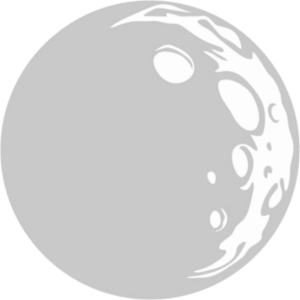

Moonlight
=========

## Instalation & Usage

* install [go](https://golang.org/dl/) on you're machine
* and then type on you're terminal `go get -u github.com/devectron/moonlight`
* `cd $GOPATH/src/github.com/devectron/moonlight`
* `go build` and then `./moonlight` OR `go run main.go`
